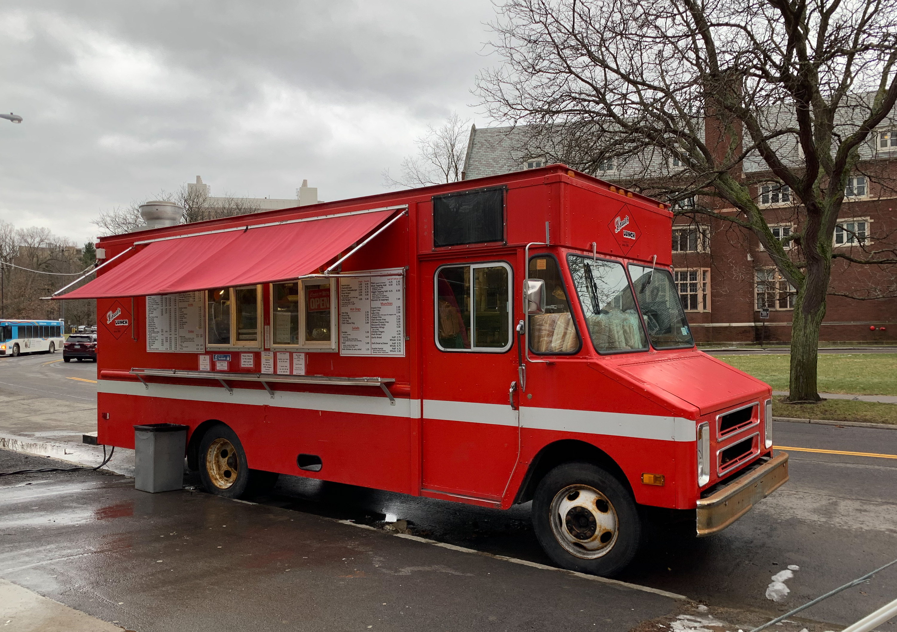

## The Problem

Food trucks are one of the best parts of eating in Hawaii. The food is good, the prices are reasonable, and they show up all over Oahu. The problem is finding them. Most trucks post their location on Instagram or Facebook the morning of, if they post at all. There is no central place to check. You either follow five different accounts and hope they updated, ask around, or drive to where you last saw them and hope they are still there. For students on campus or workers on a lunch break, that uncertainty means most people default to whatever is nearby and consistent. The trucks lose customers not because the food is bad but because nobody knows where they are.

## The Solution

A crowdsourced food truck tracker built for Oahu. Users create accounts, follow their favorite trucks, and get notified when a truck checks in near a location they care about, like UH Manoa campus. Truck owners can claim their truck profile and post their own location updates. Regular users can also drop a pin when they spot a truck in the wild. The app surfaces a live map of currently active trucks, lets users filter by food type, and shows recent check-in history so you can see how often a truck actually shows up to a given area. Every user has a personal feed based on who they follow, so the experience is different depending on what you care about.

## Proposers

Thomas Tran, University of Hawaii at Manoa

## Mockup Page Ideas

The app would need the following pages to cover the core experience:

- **Landing page** with a live map of Oahu showing active truck pins and a filter bar for food type
- **Truck profile page** with a description, menu link, follow button, and full check-in history
- **User dashboard** showing followed trucks and recent activity near saved locations
- **Check-in form** where users drop a pin on the map and tag the truck they spotted
- **Notification settings page** where users set their alert radius and preferred locations like UH Manoa

## Use Case Ideas

A few scenarios that cover how different users would actually interact with the app:

- A UH student opens the app before lunch, filters by trucks near campus, and finds one checked in at the makai side of campus 20 minutes ago
- A truck owner logs in, posts their location for the day, and sees how many followers were notified
- A user spots a familiar truck while driving through Kaimuki and submits a quick check-in with a pin
- A new user browses the map without an account, then registers to follow a specific truck they found

## Beyond the Basics

The core functionality is the map and check-in system. Beyond that, a few additions would make this more useful. First, a reliability score for each truck based on how often community check-ins match owner-posted locations. If a truck claims to be somewhere and nobody confirms it, that factors into their score over time. Second, a verification layer so truck owners can be confirmed before posting as an official source rather than a community spotter. Third, a weekly summary notification that shows which of your followed trucks was most active and where they showed up most often. That last feature turns the app from reactive to something that actually helps you plan ahead.

*Note: This essay was written with AI assistance for grammar and structure. The idea, use cases, and overall direction are my own.*
