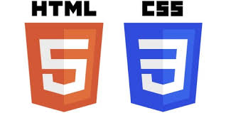

## The Learning Curve Is Real

Learning Bootstrap 5 felt like learning a new language. Not in the fun way where things click quickly, but in the frustrating way where you spend an hour figuring out why your navbar won't align properly. Coming in, I assumed HTML and CSS were enough. I'd built pages before. How hard could a framework be? Two WODs answered that question fast.

## BrowserHistory with Bootstrap 5

The first assignment was converting an existing BrowserHistory HTML page into a Bootstrap 5 layout. That meant adding a dark fixed navbar, wrapping content in Bootstrap containers, floating images, and splitting the browser sections into a three-column grid. On paper it sounds simple. In practice, getting the navbar links to anchor correctly, understanding how `fixed-top` interacts with page content, and using `col` classes to create even columns required reading a lot of documentation. Once it clicked though, the grid handled the responsive layout automatically without writing a single media query.

## Five Navbars

The harder WOD was building five different navbars from scratch, each recreating a real Hawaii restaurant or bar. Boardroom Kailua, Morning Brew, Buzz's, Aloha Beer, and Duke's Waikiki all have completely different branding. Dark teal backgrounds, centered logos, icon-only nav items, orange accent links, each one required different Bootstrap utility combinations. Getting logos centered while pushing other items to opposite ends meant understanding `d-flex`, `justify-content-between`, and `ms-auto` in ways that didn't come naturally at first. Alignment kept breaking. Images weren't showing up until I got the file paths right.

## What Bootstrap Actually Does for You

Both WODs showed the same thing. Bootstrap handles the hard responsive behavior through utility classes, but you still have to understand what those classes do. Raw CSS would have taken longer, but Bootstrap isn't automatic either. The framework meets you halfway. You still have to know what you're building.

The frustration was real but so was the result.

*I used Claude AI for grammar corrections and structure refinement.*
