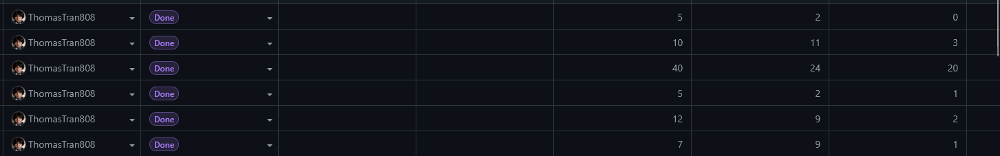

## The First Number You Put Down Is a Guess

When ICS 314 introduced effort estimation, my first reaction was skepticism. I did not know how long things would take. Nobody does at the start. Writing down a number felt like making up an answer and calling it planning. But I did it, and I was wrong — sometimes by a little, usually by a lot. What surprised me was that being wrong still turned out to be useful.

The basis for my early estimates was gut feel with almost no historical data, because I had no historical data. I knew roughly how long it took me to read documentation and get something running from a tutorial. I knew I moved faster on JavaScript than on anything database-related. I used those rough anchors. For a WOD involving Next.js routing and a new Prisma model, I estimated maybe ninety minutes. It took two and a half hours. For a Bootstrap layout task I had done something similar to before, I estimated an hour. It took forty minutes. The estimates were calibrated to a version of the work that did not include the parts that always get you — the wrong error message, the file that is in the wrong directory, the environment variable that is not being read.

## Estimating Wrong Still Beats Not Estimating

The benefit of estimating in advance is not accuracy. It is commitment. Before I wrote a number down, I had a vague sense that something would take "a while." After writing it down, I had a specific expectation I could measure against. That shift matters.

One concrete example: I estimated thirty minutes for the Prisma category feature WOD and finished in about fifty. That gap told me something — I underestimated database-related work consistently. By the time we were deep into the Bow-lletins final project, I was padding my estimates for anything touching the schema or API routes. That adjustment came directly from watching the pattern in my earlier estimates. If I had never written the thirty-minute guess down, I would not have had anything to compare to.

Another example was the opposite direction. Early in the semester I estimated two hours for a TypeScript functional programming assignment. I finished in under an hour. That told me I was overcomplicating things in my head before I started. I was treating unfamiliar syntax as harder than it actually was. The estimate forced me to make a prediction, and the prediction was wrong in a way that gave me real information.

## Tracking Actual Effort

I tracked time using a simple method: a sticky note on my monitor with a start time, and a note in my phone when I finished. Nothing automated, nothing fancy. At the end of a session I would write the actual time into the estimation spreadsheet we kept for the class.

The tracking was useful because it created a record I could look at. By mid-semester I could see that my PostgreSQL and Prisma work consistently ran over, my React component work was roughly on target, and my writing assignments always took longer than I expected because I do not count revision time when I estimate. Those patterns were invisible until I could see them across multiple weeks.

How accurate was the tracking? Probably off by ten to fifteen percent. I did not always log the time I spent thinking about a problem while doing something else — the background processing that happens when you close the laptop and then come back with an answer. I also did not consistently count time spent reading Stack Overflow or the Prisma docs as "working," even though it was. The number I tracked was real seat-time, which understates actual effort for anything involving new technology.

## What I Would Change

The main thing I would change is granularity. Logging "worked on Bow-lletins for two hours" is less useful than logging "spent forty-five minutes debugging the Prisma relation, twenty minutes on the API route, thirty-five minutes on the front-end component." The aggregate number tells you how long the task took. The breakdown tells you where you lost time, which is what you actually need for better future estimates.

I would also start tracking research time as work time from the beginning. Reading the docs and working through a problem are not separate activities. Counting one and not the other creates a systematic gap between the estimate and the reality.

The last thing is starting estimates earlier. I tended to write my estimate right before starting the task, which means I was already thinking about the approach and unconsciously adjusting the number. An estimate written the day before, when you only know what the task is but have not mentally started it, would be a cleaner test of whether you actually understand the scope.

## AI Use

I used Claude (Anthropic, claude-sonnet-4) heavily throughout the semester, primarily as a learning tool for new concepts.

When I hit something unfamiliar — Prisma relations, Next.js App Router conventions, TypeScript generics — my first move was usually to ask Claude to explain it before reading the official docs. The back-and-forth format worked better for me than documentation because I could ask follow-up questions immediately. "Why does this break when I put it in a Server Component?" gets a direct answer in thirty seconds. Finding that answer in the Next.js docs takes longer and assumes you already know what to search for.

This affected my estimation in a real way. Tasks involving technology I had already talked through with Claude ran closer to my estimates. Tasks where I went in cold ran over consistently. That pattern was data — it told me that my estimates were implicitly assuming I already understood the tool, and when I did not, I needed to budget time for actually learning it, not just doing it.

- **Tool**: Claude (Anthropic), claude-sonnet-4  
- **Representative prompts**: "Explain how Prisma one-to-many relations work and show me what the schema looks like", "Why would a useEffect run twice in development?", "What's the difference between a Server Component and a Client Component in Next.js App Router?"  
- **What I accepted**: Explanations and mental models almost entirely as-is — the value was in understanding, not copying output  
- **What I verified manually**: Any code examples I ran myself before trusting them in the project. Usually right, but occasionally used an outdated API or missed a project-specific constraint

*I used Claude AI heavily for learning new concepts and for grammar review of this essay.*
