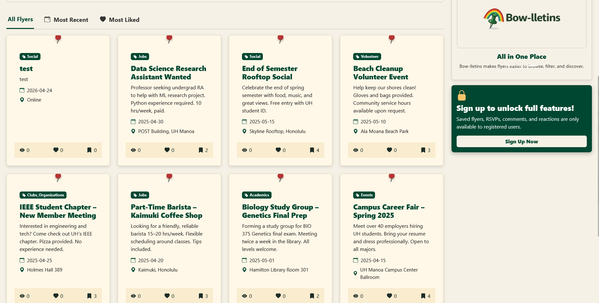

## Overview

Bowlletins is a full-stack web application built for University of Hawaii at Mānoa students. UH's existing bulletin system is fragmented. Announcements live across Instagram pages, Discord servers, and physical flyers, making it easy to miss events, study groups, job postings, and campus opportunities. Bowlletins puts everything in one place with a clean, searchable interface built around the familiar metaphor of a physical cork board.

The application allows students to create and browse flyers organized by category (jobs, events, groups, announcements), like and save postings they care about, RSVP to events, and discover what is happening across campus in a single feed. Administrators can manage content and users through a dedicated dashboard.

The stack is Next.js with the App Router, PostgreSQL for the database, Prisma as the ORM, React for the UI, and Bootstrap 5 for styling.

## My Contributions

My primary contribution was the flyer system, the core feature that makes the application work. This involved building the creation flow where users fill out a form to post a new flyer, validating and submitting that data through a Next.js API route, and persisting it to the database via Prisma. I also worked on the display side: the card components that render each flyer in the feed with its category, date, and action buttons (Like, Save, RSVP).

Alongside the feature work, I handled a significant amount of debugging across the project. Database relation issues with Prisma and session handling through NextAuth.js were recurring problems early on, and I spent time diagnosing and fixing those so the rest of the team could build on a stable foundation.

I also worked on the contact page, which handles communication between students and flyer creators. This is an important part of making the bulletin board actually useful rather than just informational.

## What I Learned

Building Bowlletins taught me how a full-stack application actually comes together when multiple people are working on different parts of the same codebase simultaneously. The Prisma schema is a shared contract, and a change to a model breaks things for everyone. Learning to make careful, deliberate changes to that schema and to communicate those changes to teammates through GitHub issues was one of the most practical lessons of the project.

I also got real experience with Issue Driven Project Management. Moving from "someone will handle the flyer stuff" to discrete issues with clear owners and definitions of done made the work trackable and caught blockers before they became crises. That workflow is something I will carry into every team project going forward.

On the technical side, I deepened my understanding of how Next.js Server Components interact with the Prisma client, how session data flows through NextAuth.js into page components, and how to structure API routes that handle both validation and database operations cleanly.

Live Site: <a href="https://bowlletins.vercel.app/"><i class="large globe icon"></i>bowlletins.vercel.app</a>

Source: <a href="https://github.com/Bowlletins"><i class="large github icon"></i>github.com/Bowlletins</a>
