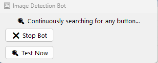

The Image Detection Bot is an automation tool I built using AutoHotkey v2.0 that monitors the screen for target images and automatically clicks them when detected. The bot features a simple GUI with real-time status updates.

The bot searches for up to four different target images using image recognition with variable tolerance levels. When found, it executes predefined click sequences. It also performs scheduled actions every 5 minutes with alternating scroll patterns.

Built with AutoHotkey v2.0, handling DPI scaling and percentage-based positioning to work across different screen sizes.
